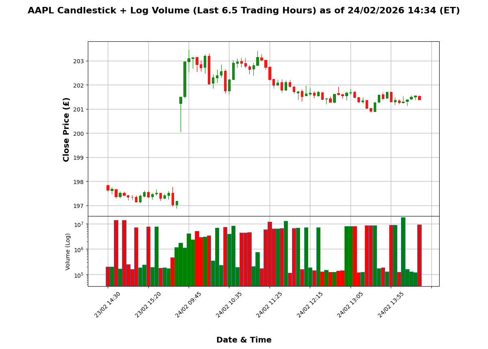
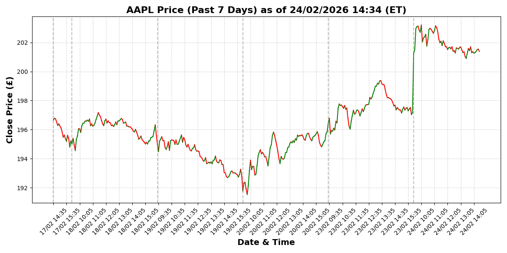

# AAPL Stock Data Pipeline (Oakland Data Engineer Task)

End-to-end data pipeline that ingests high-frequency AAPL stock data, stores it in SQL Server, and generates visual analytics in Python.

## Tech Stack

- Python 3.12.12
- yfinance
- pandas
- SQL Server
- pyodbc
- mplfinance
- matplotlib
- ODBC Driver 18 for SQL Server
- Windows OS (Linux instructions given)
  

## Architecture

- Python script fetches Apple stock data from Yahoo Finance (`yfinance`) in 1m intervals over the past 7 days.
- Data is only inserted into the SQL Server StockDB.dbo.Stocks table if there is **new data**. To do this, the `MAX(TradeDate)` within the table is used to compare with the 'trade dates' pulled over the past 7 days. If no rows are **newer** than `MAX(TradeDate)`, no data is inserted and the script continues. Since yfinance generates a maximum of 2370 rows of data (7 trading days * 6.5 trading hours / trading day * 60 minutes / hour), the processing power required is low. This is done instead of checking if the market is open as yfinance only generates new data when the markets are open for the stock of choice. So, checking if the current time is during market hours is redundant.
- 5-minute bins are used for visual clarity and reduces noise from 1-minute trading data of a high-volume stock.
- Converts USD to GBP using latest exchange rate. However, the `TradeDate` data is stored using Eastern Time. The user can remove the USD to GBP conversion, this is commented frequently in the Python script.
- Inserts **only new data** into SQL Server (`StockDB`).
- Generates:
  - **Figure 1:** Candlestick chart and Log Volume chart showing the last 6.5 trading hours (5-min bins, gaps removed) of data, Close Price (£) vs Date + Time. Title shows the Eastern Time value of the final data point in the final bin. Positive changes in Close Price are green, negatives are red. Incomplete bins are not used.
  - **Figure 2:** Colored line chart for last 7 calendar days (5-min bins, gaps removed), Close Price (£) vs Date + Time. Title shows the Eastern Time value of the final data point in the final bin. Positive changes in Close Price are green, negatives are red. Grey dashed lines for breaks within days. Incomplete bins are not used.


### Data Flow

```
Yahoo Finance API (yfinance)
↓
Data Extraction Layer
  - 1-minute intervals, last 7 days
↓
Transformation Layer
  - Timezone normalization (Eastern Time)
  - 5-minute bin aggregation
  - USD → GBP conversion
↓
Deduplication Logic
  - Compare against MAX(TradeDate) in SQL Server
↓
SQL Server (StockDB)
  - Insert only new rows
↓
Analytical Retrieval Layer
  - Retrieve last 6.5 trading hours (candlestick chart)
  - Retrieve last 7 calendar days (line chart)
↓
Visualization Layer
  - mplfinance (candlestick + log volume)
  - matplotlib (line chart)
```


## Data Model

Table: dbo.Stocks

| Column       | Type              | Description                       |
|--------------|-------------------|-----------------------------------|
| ID           | INT IDENTITY(1,1) | Identity Column                   |
| Symbol       | VARCHAR           | Stock Symbol e.g. AAPL            |
| TradeDate    | DATETIME          | Timestamp (Eastern Time)          |
| OpenPrice    | FLOAT             | Opening price (USD)               |
| HighPrice    | FLOAT             | High price (USD)                  |
| LowPrice     | FLOAT             | Low price (USD)                   |
| ClosePrice   | FLOAT             | Closing price (USD)               |
| Volume       | BIGINT            | Trading volume                    |

Primary Key: ID (`TradeDate` and `Symbol` are treated as unique for the dbo.InsertStock stored procedure)

       
## What Works

- SQL Server integration
- Data ingestion and storage (avoids duplicates)
- Candlestick and line chart visualization
  - Strict 6.5 hour data range for candlestick
  - Strict 7-day data range for line chart
  - 5min interval bins, without including 'partial' bins. i.e. running the report at 12:27 ignores 12:25-12:27, as their bin is incomplete.
- For figure 2, grey dashed lines for breaks between trading days.

## Example Output



  

## Known Limitations / Future Improvements

- Visualization layer does not currently support stable real-time streaming updates due to `mplfinance` handling of missing intraday intervals (NaN propagation during redraw events).  
  → Future improvement: migrate to Plotly Dash or a front-end dashboard architecture to support live updates.
- Automation/CI-CD not yet implemented.
- Only the past 7 days are gathered as a maximum, due to yfinance being limited with 1m intervals of data over the last 7 days.
- Figure 1 is missing the same grey dashed line, attempting to create one caused the data to be offset. From what I could find, mplfinance maps the dates to integer positions and I couldn't find a way to map it to the       correct position, causing a chasm between the data and the x-axis labels.
- Ideally, multiple graphs could be selected by the user (similarly to yahoo's stocks website) so they could observe longer-term trends.
- Timestamps are currently naive but labeled as Eastern Time (ET) to reflect NYSE trading hours. With more time, I would make them timezone-aware using 'pytz' or 'zoneinfo' to handle daylight saving and multi-timezone display correctly
- Add logging, error handling, and retry logic for network/API issues.
  

## How to Run

1. Clone the Repository
Download the repository to a local directory. For example:
C:\Users\<your-username>\Documents\Projects\AAPL_Stock_Project

2. Create and Activate a Python Virtual Environment
Windows:
```bash
python -m venv venv
venv\Scripts\activate
```

macOS / Linux:
```bash
python3 -m venv venv
source venv/bin/activate
```

Once activated, your terminal prompt should show (venv).

3. Install Required Python Packages
Install all dependencies using the provided requirements.txt:
```py
pip install -r requirements.txt
```

5. Configure SQL Server
  1. Ensure SQL Server is installed and accessible.
  2. Run the following SQL scripts which are stored in C:\Users\<your-username>\Documents\Projects\AAPL_Stock_Project\SQL in order, using SQL Server Management Studio (SSMS) or another SQL client:

     - Create StockDB and dbo.Stocks table.sql
       Creates the StockDB database and the dbo.Stocks table to store AAPL stock data.

     - Create InsertStock.sql
       Creates a stored procedure to insert new stock data into dbo.Stocks.

     - Create GetLatestStocks.sql
       Creates a stored procedure to retrieve recent stock data for visualization and analysis.

Optional: update the database connection string in Import_and_Display_AAPL_Stock_Data.py
if your server name, authentication method, or database differs.

Example connection string template:

```sql
conn_str = (
    "DRIVER={ODBC Driver 18 for SQL Server};"
    "SERVER=<server_name>;"
    "DATABASE=StockDB;"
    "Trusted_Connection=yes;"
)
```

5. Run the Python Script
Execute the main script to fetch, store, and visualize AAPL stock data:
```bash
python Import_and_Display_AAPL_Stock_Data.py
```

You should see console output similar to:
```bash
Fetching data...
Inserting into SQL...
Converting to GBP...
Retrieving last 24 hours...
Plotting...
```

6. View the Figures
- Figure 1: Candlestick chart + log volume chart for the last 6.5 trading hours (5-min bins).
  Positive price changes are green; negative changes are red.
  Incomplete bins are ignored.

- Figure 2: Colored line chart for the last 7 calendar days (5-min bins).
  Grey dashed lines mark breaks between trading days.
  Positive/negative price changes are colored green/red.
  Incomplete bins are ignored.

Figures will open in separate windows using matplotlib and mplfinance.
Close the windows to terminate the script.

7. Optional Notes
- Currency Conversion: By default, the script converts USD to GBP. To disable, uncomment the relevant lines in the script.
- Time Zones: All timestamps are normalized to Eastern Time (ET) to reflect NYSE trading hours.
- Troubleshooting:
  * Ensure your Python version is 3.12 or above.
  * Make sure SQL Server allows connections from Python via ODBC.
  * If plots fail to render, check matplotlib backend settings or ensure your Python environment can open GUI windows.
 
  

- Alistair
https://github.com/alistairthomson130502
